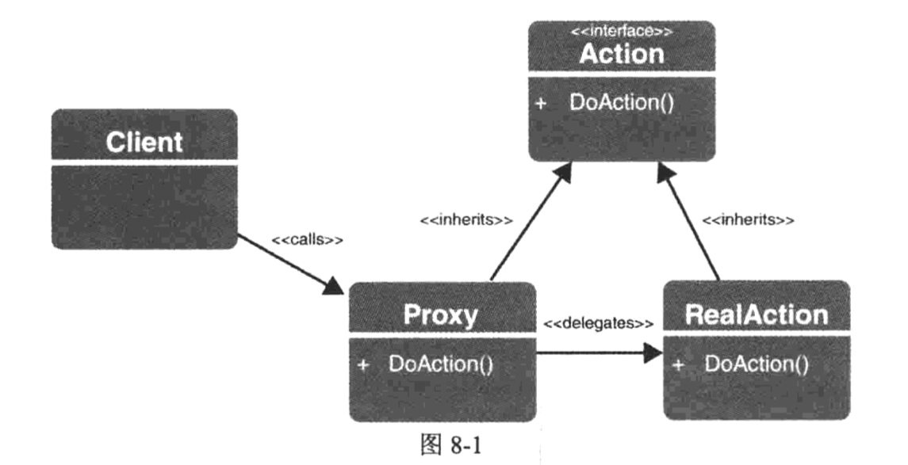

## Spring笔记
#### Spring依赖注入的方式
* 基于XML的方式，setter注入，允许集合注入\<set>、\<list>、\<map>、\<array>，可以循环依赖（不建议）

```
<bean id="accountService" class="com.test.AccountServiceImpl">
	<property name="accountDao" ref="accountDao"/>
</bean>
```
* 构造函数注入，无法循环依赖

```
<bean id="accountService" class="com.test.AccountServiceImpl">
	<constructor-arg ref="accountDao"/>
</bean>
```

* 基于注解的方式@Autowired
* @Bean标签的公共方法都对应一个Bean的定义，该Bean交给容器管理
* @Configuration标签该类是一个Bean并且包含配置元数据

#### 配置和使用容器
* AnnotationConfigApplicationContext基于Java配置元数据初始化容器（创建时可以传入多个入参）
* ClassPathXmlApplicationContext基于xml配置元数据初始化容器
* 容器默认的实例化Bean为单例
* \<context:component-scan/>作用是扫描包路径中的类
* 重写Bean定义，两个同样的@Configuration类
* classpath:扫描当前class路径下的配置文件，只能加载找到的第一个文件
* classpath*:从多个jar文件中加载相同的文件
* depends-on，类之间的依赖，@DependsOn在类级别使用时，只有注解内依赖的Bean被创建之后才会创建本类；在方法级别使用时，则只对基于Java的配置产生影响

```
<bean id="a" class="com.test.A" depends-on="b,c"/>
```
* 自动装配的三种模式：byType、byName、constructor
* @Value注入内置的Java类型的属性值，支持Spring表达式和占位符\<context:property-placeholder location="classpath:application.properties"/>
* 类中有静态或实例工厂方法（static），注解话不用改变还是原来的标签

```
<bean id="foo3" class="com.test.FooFactory" factory-method="createFoo3"/>
```
* Bean作用域，默认时Singleton，第二种作用域：prototype（类似new操作符），针对Web应用引入的作用域Request和Session

```
<bean id="userPreferences" class="com.test.UserPreferences">
	<!--使用Request或Session作用域时需要添加的子元素-->
	<aop:scoped-proxy/>
</bean>
```
如果正在使用Spring MVC处理Web请求，则不需要做任何事情就可以让Request作用域Bean和Session作用域Bean正确工作，如果是其他处理方式，则必须在web.xml文件中添加ServletRequestListener定义

```
<web-app>
	<listener>
		<listener-class>
			org.springframework.web.context.request.RequestContextListener
		</listener-class>
	</listener>
</web-app>
```
@Scope注解通过一个String值标识Bean定义的作用域

* Bean延迟初始化，<bean>元素中使用lazy-init定义为延迟，default-lazy-init将一个XML文件中的所有Bean定义为延迟，@Lazy标签定义Bean延迟初始化；优点：加快了容器的启动时间，缺点：无法在启动时发现Bean的配置错误
* 生命周期的回调，<bean>元素有init-method和destroy-method特性，Prototype作用域Bean实例化之后不被跟踪，因此它们的destroy方法不能被调用；@PostConstruct和@PreDestroy标签放置在方法之上，但是需要添加\<context:annotation-config/>激活对该标签的处理；实现InitializingBean和DisposableBean接口
* @Import注解导入相应的配置类，@ImportResource注解导入相应的XML bean配置文件

#### SpringMVC
* 前端控制器：Dispatcher Servlet，处理器映射：HandlerMapping，视图解析器：ViewResolver
* 实现ServletContextAware接口，可以访问Servlet上下文
* @Controller标签，Dispatcher Servlet扫描被@Controller注解的类，从而将Web请求映射到被@RequestMapping注解的方法上
* @RequestMapping标签，用来将用户的请求映射到处理类或方法
* @ModeAttribute标签，使用一个向视图公开的健将一个返回值与一个参数绑定起来，可以在方法级别或方法的参数上应用该注解
* @PathVariable注解，将一个方法参数绑定到一个URL模板

#### Spring数据库相关
* 不要在生产环境使用DriverManagerDataSource，因为没有连接池功能
* 在应用程序启动期间，使用一些SQL脚本初始化数据库，enabled为true时才进行初始化

```
<jdbc:initialize-database data-source="dataSource" enabled="#{systemProperties.INIT_DB}">
	<jdbc:script location="classpath:schema.sql"/>
	<jdbc:script location="classpath:data.sql"/>
</jdbc:initialize-database>
```

#### SpringJPA
* @GeneratedValue注解的strategy属性指定实体类的ID生成策略；如果没有指定，Oracle使用SEQUENCE，MySQL使用IDENTITY
* @Transient注解、transient修饰符标记某一属性不持久化
* 在配置类顶部放置@EnableTransactionManagement注解，从而启用Spring容器管理事务

#### Spring管理事务
* ACID（原子性、一致性、隔离性、持久性）
* 本地事务：应用程序使用单一数据库；全局事务：分布式事务管理，涉及多个数据库
* Spring的事务抽象模型基于PlatformTransactionManager接口
* EJB使用JTA来处理事务管理，JTA采用了两阶段提交（2PC）策略
* @EnableTransactionManagement注解激活了基于注解的声明式事务管理，@Transactional注解开启事务
* @Transactional注解属性：propagation：定义了事务范围；isolation：指定了底层数据库系统的隔离级别；timeout：指定了事务超时时间；readonly：对底层事务子系统的提示，告诉事务子系统方法仅仅执行读操作；rollbackFor和noRollbackFor：期待相关的类；
* 类上面放置@Transactional注解，那么类中所有公共方法都被事务化
* 没有异常抛出同时想执行事务回滚，可以使用下面这句代码：

```
TransactionAspectSupport.currentTransactionStatus().setRollbackOnly();
```
* AopContext.currentProxy()静态方法调用返回当前活动代理对象，解决同一Bean的另一个事务方法中调用事务方法
* \<tx:advice>配置事务属性，\<aop:config>指定Spring Bean中哪些公共方法上应用相关配置

```
<tx:advice id="FileName_txAdvice" transaction-manager="transactionManager">
	<tx:attributes>
		<tx:method name="*" propagation="REQUIRED"/>
	</tx:attributes>
</tx:advice>
<aop:config>
	<aop:advisor advice-ref="txAdvice" pointcut="bean(accountService)"/>
</aop:config>
```
* 使用编程方式控制事务的机制，TranasactionTemplate（Spring推荐）、PlatformTransactionManager API
* 通知事务性操作，实现MethodInterceptor接口，TransactionSynchronization接口

#### Spring面向切面
* 接合点（Join-point）、通知（Advice）、切入点（Point-cut）、目标（Target）、编织（Weaving-编译时、加载时、运行时）；Spring AOP通过Proxy模型
* 
* 

